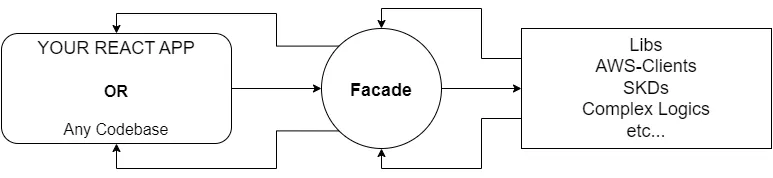

# Gestão de Pets e Tutores

Este projeto faz parte de um processo seletivo para a vaga de Desenvolvedor Frontend e tem como objetivo avaliar capacidade de organização de código, tomada de decisão arquitetural, consumo de API e implementação de fluxos completos de CRUD.

A aplicação implementa um cadastro público de pets, tutores e o relacionamento entre eles, consumindo uma API pública.

## Dados da inscrição
- Candidato: Igor Michael Pereira da Silva
- Vaga: Desenvolvedor Frontend
- Stack principal: React 18, TypeScript, Vite, TailwindCSS

## Motivações
A arquitetura foi pensada com foco em separação clara de responsabilidades, baixo acoplamento entre UI, regras de negócio e infraestrutura.

Neste sentido a UI é organizada por responsabilidade (pages, hooks, components), o domínio separado da UI e a comunicação com a API é mediada por facades.

Como descrita na imagem a seguir:



> Isso evita por exemplo, que componentes e páginas acumulem regras de negócio e lógica de fluxo, e
que não ocorra comunicação direta entre UI e serviços de infraestrutura.

A escolha das seguintes de bibliotecas também foi primordial para o cumprir esses objetivos:
- Build: Vite (builds muito mais rápidos)
- Gerenciamento de estado: Jotai (diminui complexidade)
- Roteamento: React Router
- Cache e Gerenciamento de dados: TanStack React Query
- Formulários: React Hook Form e Yup para validações

## Vamos começar

### Primeiros passos

Clonar projeto.
```bash
 git clone https://github.com/igor-sillva/igor033547.git
```
Acessar o diretório do projeto.

```bash
cd igor033547
```

## Como Executar o Projeto
### Pré-requisitos
- Node.js 24+
- Docker

### Execução local
```bash
npm install
npm run dev
```

### Execução via Docker
```bash
docker build -t igor033547 .
docker run -p 8000:8000 igor033547
```

Acesse: <https://localhost:8000>
